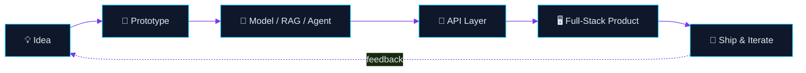
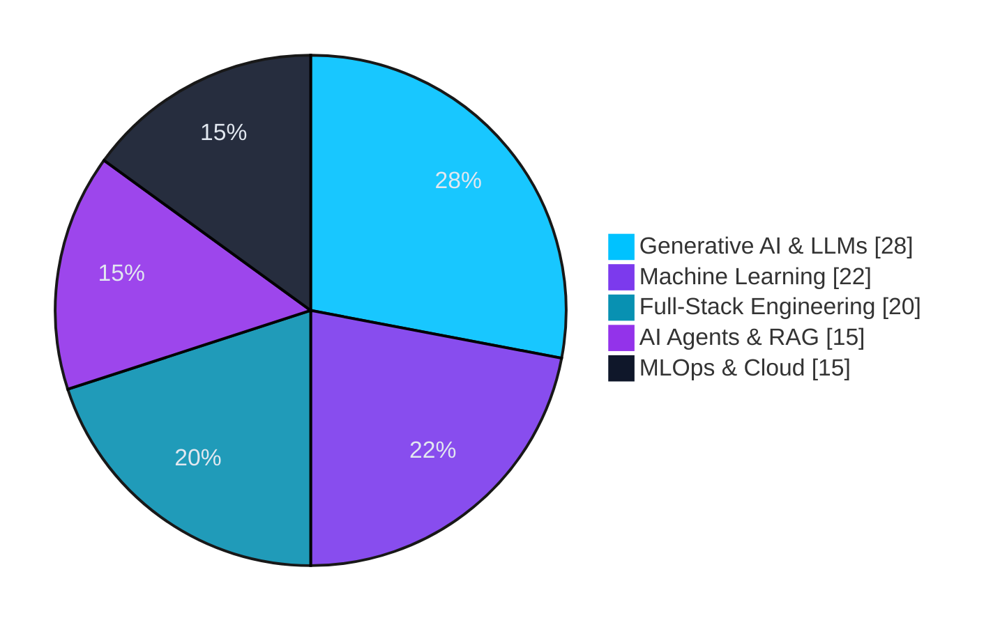

<div align="center">


<sub>

&nbsp;

</sub>

<br/><br/>

<a href="#about"></a>
<a href="#stack"></a>
<a href="#projects"></a>
<a href="#roadmap"></a>
<a href="#metrics"></a>
<a href="#connect"></a>

</div>

<br/>

<a name="about"></a>
## ⚡ About

```yaml
name:        Vasanthakumar S
role:        B.Tech Student — Artificial Intelligence & Data Science
mission:     Engineer complete intelligent systems, not just train models
belief:      "Connect models, APIs, databases & interfaces into real products"
status:      Building, breaking, and rebuilding things — one commit at a time
```

**How I build things:**



<br/>

<a name="stack"></a>
## 🧰 Tech Stack

<div align="center">

| Category | Stack |
|:--|:--|
| **Languages** |  |
| **AI / ML / GenAI** | <br/><sub>Scikit-learn · Pandas · NumPy · LLMs · RAG · Embeddings · Semantic Search · Prompt Engineering · Hugging Face · Sentence Transformers · FAISS · SHAP · AI Agents</sub> |
| **Backend** | <br/><sub>REST APIs · WebSockets</sub> |
| **Frontend** |  |
| **Databases** |  |
| **DevOps & Cloud** |  |

</div>

**Where the hours go:**



<br/>

<a name="projects"></a>
## 🚀 Projects

**At a glance**

| Project | What it does | Core Tech | Links |
|:--|:--|:--|:--|
| 🛠️ **DevForge** | All-in-one dev workspace: AI assistant, PM, notes, scheduling | Flask · PostgreSQL · Docker | [Repo](https://github.com/itz-vk-dude/devforge) · [Live](https://devforge-smoky.vercel.app) |
| 🌱 **EcoMetal LCA** | AI-driven life cycle assessment for metal manufacturing | FastAPI · React · SHAP | [Repo](https://github.com/itz-vk-dude/EcoMetal-LCA) |
| 🐞 **AI Debugging Toolkit** | ML + LLM pipeline that diagnoses and fixes code errors | Flask · LLMs · OpenRouter | [Repo](https://github.com/itz-vk-dude/ai-debugging) |
| 🌳 **PROJECTREE** | AI project discovery & learning companion for students | Flask · PostgreSQL · LLMs | [Repo](https://github.com/itz-vk-dude/projectree) · [Live](https://projectree-gules.vercel.app) |
| 📂 **AI Files Assistant** | Prompt-chained document intelligence workflows | Python · LLMs | [Repo](https://github.com/itz-vk-dude/AI-Files-Assistant) |
| 🧠 **NERO-SWARM** | Multi-agent engine — agents critique & synthesize together | FastAPI · WebSockets · LLMs | [Repo](https://github.com/itz-vk-dude/NERO-SWARM) |
| 📊 **AI Analysis** | Local-first RAG platform for documents & datasets | FastAPI · RAG · Hugging Face | [Repo](https://github.com/itz-vk-dude/ai_analysis) |
| 🎪 **TechFest 2027** | Full-stack event web application | Flask · SQL | [Repo](https://github.com/itz-vk-dude/TechFest-2027) |
| 🐦 **Flappy Bird — Django** | Classic Flappy Bird, rebuilt on Django | Django · JS | [Repo](https://github.com/senthilp005/flappybird-django) |

<br/>

**Featured deep-dives**

<details open>
<summary><b>🛠️ DevForge — Developer Workspace</b></summary>
<br/>

*A full-stack productivity platform that puts project management, scheduling, notes, and an AI assistant into one workspace.*

- Built-in AI assistant + rich AI-powered notepad
- Project management, README editor, scheduling & calendar
- User profiles, resume generation, multiple themes, responsive UI

    

🔗 [Repository](https://github.com/itz-vk-dude/devforge) &nbsp;·&nbsp; 🌐 [Live Demo](https://devforge-smoky.vercel.app)

</details>

<details>
<summary><b>🌱 EcoMetal LCA — AI-Powered Life Cycle Assessment</b></summary>
<br/>

*Analyzes the environmental footprint of metal manufacturing through ML-driven emissions modeling and explainable AI.*

- ML-based CO₂ / SOx / NOx emissions prediction with SHAP explainability
- Environmental hotspot detection, scenario & sensitivity modeling
- ISO 14040/14044 compliance tracking, PDF & Excel reporting

    

🔗 [Repository](https://github.com/itz-vk-dude/EcoMetal-LCA)

</details>

<details>
<summary><b>🐞 AI Debugging Toolkit</b></summary>
<br/>

*Diagnoses and resolves programming errors by combining ML, rule-based analysis, and LLM reasoning.*

- Stack trace analysis, root-cause detection, ML-based error prediction
- LLM diagnosis pipeline with automated code correction & explanations
- Developer challenges, leaderboard, in-browser code execution

   

🔗 [Repository](https://github.com/itz-vk-dude/ai-debugging)

</details>

<details>
<summary><b>🌳 PROJECTREE — AI Project Discovery</b></summary>
<br/>

*Helps students discover projects matched to their interests and skill level, with AI-guided learning support.*

- ML-powered recommendations, discovery quiz, AI-generated study guides
- Learning progress dashboard with streak & level tracking
- Community project feed, portfolio PDF export

   

🔗 [Repository](https://github.com/itz-vk-dude/projectree) &nbsp;·&nbsp; 🌐 [Live Demo](https://projectree-gules.vercel.app)

</details>

<details>
<summary><b>📂 AI Files Assistant — PromptChainAI</b></summary>
<br/>

*Intelligent file analysis and AI-assisted document interaction, built around prompt-chained workflows.*

- AI file interaction and document intelligence
- Prompt chaining across conversational analysis interfaces

  

🔗 [Repository](https://github.com/itz-vk-dude/AI-Files-Assistant)

</details>

<details>
<summary><b>🧠 NERO-SWARM — Swarm Intelligence Engine</b></summary>
<br/>

*A multi-agent architecture where specialized agents collaborate, critique, and synthesize solutions together.*

**Agents:** Analyst · Creative · Critic · Feasibility · Synthesizer

- Cross-agent critique, trust scoring, divergence measurement
- Consensus engine with weighted answer synthesis
- Real-time WebSocket streaming, event-driven orchestration

   

🔗 [Repository](https://github.com/itz-vk-dude/NERO-SWARM)

</details>

<details>
<summary><b>📊 AI Analysis — PromptChain AI</b></summary>
<br/>

*A local-first data intelligence platform for analyzing documents and datasets through conversational AI.*

- Local upload + Google Drive integration; PDF/DOCX/XLSX/CSV/TXT/JSON processing
- Image OCR, audio transcription, RAG-based retrieval with sentence embeddings
- Interactive charts, scenario forecasting, synthetic data generation

   

🔗 [Repository](https://github.com/itz-vk-dude/ai_analysis)

</details>

<details>
<summary><b>🎪 TechFest 2027</b></summary>
<br/>

*A full-stack event web application with a Flask-style architecture.*

- Event-oriented web app with template-based frontend
- SQL-based data handling, full-stack application architecture

  

🔗 [Repository](https://github.com/itz-vk-dude/TechFest-2027)

</details>

<details>
<summary><b>🐦 Flappy Bird — Django Edition</b></summary>
<br/>

*A Django-powered take on the classic Flappy Bird, blending Python web dev with browser game assets.*

- Django application structure with static asset management
- Deployment configuration for a web-based game

  

🔗 [Repository](https://github.com/senthilp005/flappybird-django)

</details>

<br/>

<a name="roadmap"></a>
## 🌱 Roadmap

| Track | Focus | Status |
|:--|:--|:--|
| **AI Engineering** | Advanced ML, LLMs, RAG, multi-agent / agentic AI | 🟢 Actively building |
| **Software Engineering** | System design, scalable backend, production AI systems | 🟢 Actively building |
| **MLOps & DevOps** | Docker, Kubernetes, CI/CD, model deployment | 🟡 Leveling up |
| **Cloud** | Microsoft Azure, cloud-native deployment | 🟡 Leveling up |
| **Target roles** | AI / ML / Software Engineering positions | 🎯 Preparing |

<br/>

<a name="metrics"></a>
## 📊 Metrics

<div align="center">


</div>

<br/>

<a name="connect"></a>
## 🤝 Connect

<div align="center">

Open to collaborating on **AI · Machine Learning · Generative AI · AI Agents · Data Science · Full-Stack Development**

<a href="https://github.com/itz-vk-dude"></a>
&nbsp;
<a href="https://linkedin.com/in/YOUR_LINKEDIN"></a>
&nbsp;
<a href="mailto:YOUR_EMAIL"></a>

<br/><br/>

### *"I carry dreams in my hands and turn them into intelligent solutions."*

**Think → Build → Experiment → Learn → Improve**


</div>
